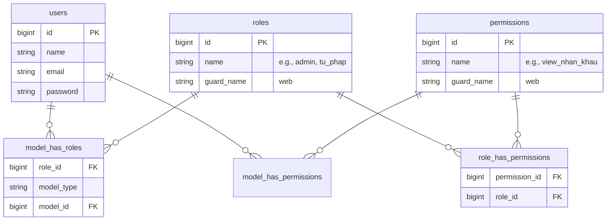

# Kế hoạch Phân quyền (RBAC) & Thiết lập Dữ liệu Hệ thống

Tài liệu này đề xuất phương án và kế hoạch chi tiết để triển khai hệ thống phân quyền dựa trên vai trò (Role-Based Access Control - RBAC) và đồng bộ hoá dữ liệu người dùng cho dự án **Quản lý Hộ dân cư UBND Xã**.

---

## 1. Danh sách Vai trò (Roles) trong UBND Xã

Hệ thống được thiết kế để phục vụ các nhóm cán bộ với phạm vi công việc chuyên biệt:

| Tên Vai Trò (Slug) | Tên Hiển Thị | Mô Tả Phạm Vi |
| :--- | :--- | :--- |
| `admin` | **Admin Hệ thống** | Toàn quyền kiểm soát hệ thống, quản lý tài khoản cán bộ, xem nhật ký thao tác (Audit Logs), backup hệ thống. |
| `tu_phap` | **Cán bộ Tư pháp** | Quản lý hộ tịch và cư trú (Hộ khẩu, nhân khẩu, tạm trú/tạm vắng, biến động hộ tịch). |
| `lao_dong` | **Cán bộ Lao động - TB&XH** | Quản lý kinh tế, trạng thái lao động, kết nối việc làm, diện chính sách, trợ cấp an sinh xã hội. |
| `dia_chinh` | **Cán bộ Địa chính** | Quản lý đất đai, tài sản và các khoản thuế, phí địa phương của hộ gia đình. |
| `quan_su` | **Cán bộ Quân sự** | Quản lý nghĩa vụ quân sự và dân quân tự vệ của xã. |
| `truong_thon` | **Trưởng thôn/xóm** | Chỉ xem và báo cáo số liệu hộ dân trong phạm vi thôn/xóm được phân công quản lý. |

---

## 2. Ma trận Phân quyền (Permissions Matrix)

Các quyền chi tiết (Permissions) được định nghĩa theo cấu trúc dạng `action_module` (Ví dụ: `view_nhan_khau`, `create_ho_khau`...).

> [!NOTE]
> Mọi cán bộ đều có quyền đọc thông tin nhân khẩu cơ bản (Họ tên, ngày sinh, quan hệ) để đối chiếu thông tin khi thực hiện nghiệp vụ chuyên môn, nhưng quyền chỉnh sửa chỉ giới hạn ở module chuyên trách.

| Phân hệ / Bảng | Admin | Cán bộ Tư pháp | Cán bộ Lao động | Cán bộ Địa chính | Cán bộ Quân sự | Trưởng thôn |
| :--- | :---: | :---: | :---: | :---: | :---: | :---: |
| **Quản trị User & Logs** (`users`, `audit_logs`) | **Full** | Không | Không | Không | Không | Không |
| **Hộ tịch & Cư trú** (`ho_khau`, `nhan_khau`, `tam_tru_tam_vang`) | **Full** | **Full** | Xem | Xem | Xem | Xem (Thôn mình) |
| **Lao động & Doanh nghiệp** (`lao_dong`, `doanh_nghiep`, `ket_noi`) | **Full** | Xem | **Full** | Xem | Xem | Xem (Thôn mình) |
| **An sinh & Trợ cấp** (`doi_tuong_chinh_sach`, `bao_tro`, `dot_tro_cap`) | **Full** | Xem | **Full** | Xem | Xem | Xem (Thôn mình) |
| **Nghĩa vụ quân sự** (`nghia_vu_quan_su`, `dan_quan_tu_ve`) | **Full** | Xem | Xem | Xem | **Full** | Xem (Thôn mình) |
| **Đất đai & Thuế phí** (`dat_dai_tai_san`, `thue_va_phi`) | **Full** | Xem | Xem | **Full** | Xem | Xem (Thôn mình) |

*Ghi chú:* 
* **Full**: CRUD (Tạo, Đọc, Sửa, Xóa).
* **Xem**: Chỉ đọc (Read-only).
* **Không**: Không được phép truy cập.

---

## 3. Cấu trúc Bảng CSDL phục vụ Phân quyền (RBAC Schema)

Dự án sẽ sử dụng thư viện **`spatie/laravel-permission`** để quản lý quan hệ nhiều-nhiều giữa Users, Roles và Permissions. Sơ đồ các bảng dữ liệu phát sinh bao gồm:



---

## 4. Kế hoạch triển khai mã nguồn

### Bước 1: Cài đặt và Xuất bản gói cấu hình Spatie
Chạy lệnh cài đặt gói thư viện thông qua Composer:
```bash
rtk composer require spatie/laravel-permission
rtk php artisan vendor:publish --provider="Spatie\Permission\PermissionServiceProvider"
rtk php artisan migrate
```

### Bước 2: Tích hợp vào Model `User`
Thêm trait `HasRoles` vào `app/Models/User.php`:
```php
namespace App\Models;

use Illuminate\Foundation\Auth\User as Authenticatable;
use Spatie\Permission\Traits\HasRoles;

class User extends Authenticatable
{
    use HasRoles;
    // ...
}
```

### Bước 3: Tạo Seeder Phân quyền (`RolesAndPermissionsSeeder`)
Tạo Seeder để khởi tạo toàn bộ danh sách vai trò và phân quyền, sau đó gắn quyền cho các tài khoản cán bộ mẫu tương ứng. Các cán bộ đều được cấp quyền xem (`view_*`) của tất cả các phân hệ khác để có thể xem chéo màn hình của nhau, nhưng quyền chỉnh sửa và thao tác (`manage_*`) thì thuộc về cán bộ chuyên trách:

```php
// database/seeders/RolesAndPermissionsSeeder.php
public function run()
{
    // Reset cached roles and permissions
    app()[\Spatie\Permission\PermissionRegistrar::class]->forgetCachedPermissions();

    // 1. Tạo Permissions
    $permissions = [
        'manage_users', 'view_audit_logs',
        
        // Phân hệ Hộ tịch & Cư trú
        'view_ho_khau', 'manage_ho_khau',
        'view_nhan_khau', 'manage_nhan_khau',
        
        // Phân hệ Lao động & Doanh nghiệp
        'view_lao_dong', 'manage_lao_dong',
        
        // Phân hệ An sinh & Trợ cấp
        'view_an_sinh', 'manage_an_sinh',
        
        // Phân hệ Nghĩa vụ quân sự
        'view_nghia_vu', 'manage_nghia_vu',
        
        // Phân hệ Đất đai & Thuế phí
        'view_dat_dai', 'manage_dat_dai',
    ];
    foreach ($permissions as $permission) {
        Permission::create(['name' => $permission]);
    }

    // 2. Tạo Roles và gán permissions
    $admin = Role::create(['name' => 'admin']);
    $admin->givePermissionTo(Permission::all());

    // Cán bộ Tư pháp (Hộ tịch & Cư trú)
    $tuPhap = Role::create(['name' => 'tu_phap']);
    $tuPhap->givePermissionTo([
        'view_ho_khau', 'manage_ho_khau',
        'view_nhan_khau', 'manage_nhan_khau',
        'view_lao_dong',
        'view_an_sinh',
        'view_nghia_vu',
        'view_dat_dai',
    ]);

    // Cán bộ Lao động
    $laoDong = Role::create(['name' => 'lao_dong']);
    $laoDong->givePermissionTo([
        'view_ho_khau',
        'view_nhan_khau',
        'view_lao_dong', 'manage_lao_dong',
        'view_an_sinh', 'manage_an_sinh',
        'view_nghia_vu',
        'view_dat_dai',
    ]);

    // Cán bộ Địa chính
    $diaChinh = Role::create(['name' => 'dia_chinh']);
    $diaChinh->givePermissionTo([
        'view_ho_khau',
        'view_nhan_khau',
        'view_lao_dong',
        'view_an_sinh',
        'view_nghia_vu',
        'view_dat_dai', 'manage_dat_dai',
    ]);

    // Cán bộ Quân sự
    $quanSu = Role::create(['name' => 'quan_su']);
    $quanSu->givePermissionTo([
        'view_ho_khau',
        'view_nhan_khau',
        'view_lao_dong',
        'view_an_sinh',
        'view_nghia_vu', 'manage_nghia_vu',
        'view_dat_dai',
    ]);

    // 3. Gán Role cho tài khoản trong UserSeeder
    $userAdmin = User::where('email', 'admin@ubnd-xa.vn')->first();
    if ($userAdmin) $userAdmin->assignRole('admin');

    $userTuPhap = User::where('email', 'tupháp@ubnd-xa.vn')->first();
    if ($userTuPhap) $userTuPhap->assignRole('tu_phap');
    
    $userLaoDong = User::where('email', 'laodong@ubnd-xa.vn')->first();
    if ($userLaoDong) $userLaoDong->assignRole('lao_dong');

    $userDiaChinh = User::where('email', 'diachinh@ubnd-xa.vn')->first();
    if ($userDiaChinh) $userDiaChinh->assignRole('dia_chinh');
}
```

### Bước 4: Bảo mật Route bằng Middleware Quyền (Permissions)
Thay vì chặn thô bằng Role ở cấp độ nhóm Route, chúng ta bảo vệ các route bằng cách kiểm tra quyền (`can:permission_name`). Cách này giúp các cán bộ đều vào được màn hình danh sách (Read) nhưng chỉ cán bộ có quyền sửa đổi mới thực hiện được (Write/Mutate):

```php
// routes/web.php

// Mọi cán bộ đã đăng nhập đều có quyền xem (Read) các module
Route::middleware(['auth'])->group(function () {
    // Xem danh sách và chi tiết Hộ khẩu, Nhân khẩu
    Route::get('ho-tich/ho-khau', [HoKhauController::class, 'index'])->name('ho-khau.index');
    Route::get('ho-tich/ho-khau/{hoKhau}', [HoKhauController::class, 'show'])->name('ho-khau.show');
    Route::get('ho-tich/nhan-khau', [NhanKhauController::class, 'index'])->name('nhan-khau.index');
    Route::get('ho-tich/nhan-khau/{nhanKhau}', [NhanKhauController::class, 'show'])->name('nhan-khau.show');

    // Xem danh sách Lao động
    Route::get('lao-dong/ho-so', [LaoDongController::class, 'index'])->name('lao-dong.index');
});

// Chỉ cán bộ chuyên trách (Tư pháp / Admin) mới được thêm/sửa/xoá hộ tịch
Route::middleware(['auth', 'can:manage_ho_khau'])->group(function () {
    Route::get('ho-tich/ho-khau/create', [HoKhauController::class, 'create'])->name('ho-khau.create');
    Route::post('ho-tich/ho-khau', [HoKhauController::class, 'store'])->name('ho-khau.store');
    Route::get('ho-tich/ho-khau/{hoKhau}/edit', [HoKhauController::class, 'edit'])->name('ho-khau.edit');
    Route::put('ho-tich/ho-khau/{hoKhau}', [HoKhauController::class, 'update'])->name('ho-khau.update');
    Route::delete('ho-tich/ho-khau/{hoKhau}', [HoKhauController::class, 'destroy'])->name('ho-khau.destroy');
});
```

### Bước 5: Ẩn/Hiện phần tử trên Giao diện Blade
Sử dụng chỉ thị `@can` hoặc `@role` để kiểm soát các menu hành động trên sidebar và danh sách hành động của người dùng:
```html
{{-- resources/views/layouts/app.blade.php --}}
@role('tu_phap')
    <a class="submenu-link" href="{{ route('ho-khau.create') }}">
        <i class="bi bi-plus-lg"></i> Thêm mới hộ khẩu
    </a>
@endrole

@can('delete_nhan_khau')
    <button class="btn btn-sm btn-danger btn-delete">Xóa</button>
@endcan
```
